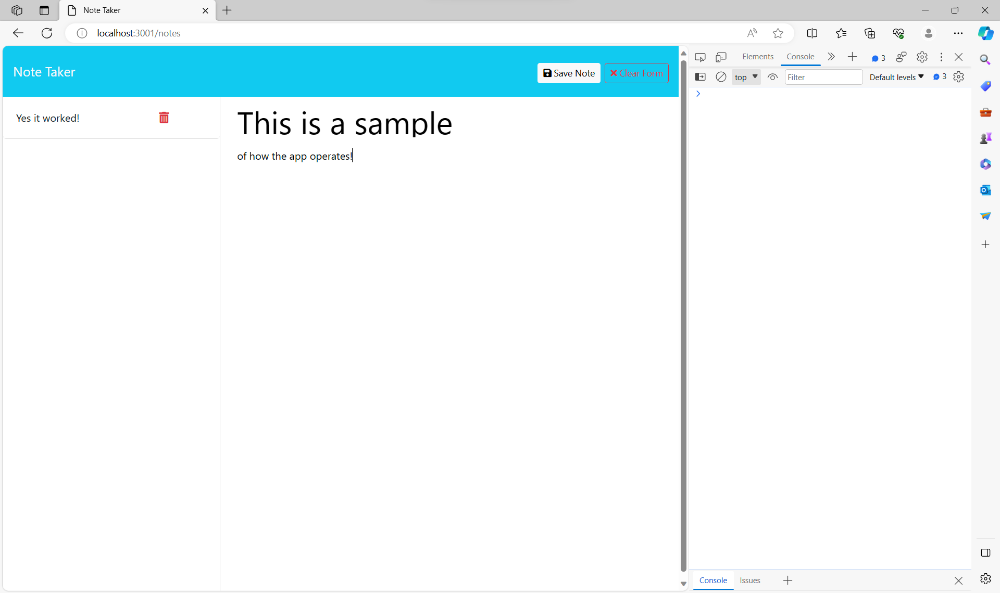

# Note Taker - Module 11 Challenge
## Description

This note taker app was designed to allow the user to create, manage, and delete notes using a simple and organized interface. The user only
needs to add a title and body for their note and save it. The note will be displayed in a list on the left side of the page.

This exercise helped further my understanding of node, express, and routing. This app required the addition of several interlinked files which
also taught me the importance of structuring and organizing my code for editing purposes. It also helped me to understand how to link apis to
multiple html files and link them together.

## Installation

To use this app, the user needs to have express, uuid, and path installed prior to running the code. To install these packages, the user opens the
terminal in VSCode and uses the command 'npm i express', 'npm i uuid', and 'npm i path' and After installation, the user runs server.js
using the command 'node server.js' and accesses the the local host at port 3001 using: http://localhost:3001/

## Usage

After accessing the app on localhost, the user just needs to click the "Get Started" button and they'll me taken to the main interface. The user clicks 
on the title header and can type whatever title they wish and then clicks the font in the body to do the same. Once both have been filled out, the user
clicks the "Save Note" button which will save their note to a list displayed in a column on the left side of the page. They can then click a note from
the list to display the saved note. If the user wants to delete a note, they just need to click on the trash icon and the note will be deleted.

## Credits

Source files including HTML, CSS, and index.js were supplied by the coding boot camp: https://github.com/coding-boot-camp/miniature-eureka

## License

There is no license for this project.

## Link:

## Screenshot of Note Taker Functionality

